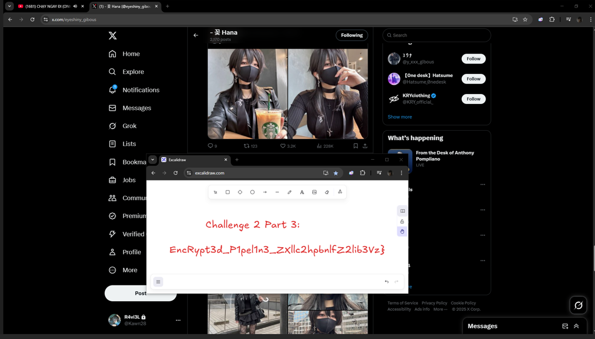

# Cutsom Tunnel

So there are 3 parts of flag that we need to find

first part of the flag can be found just by running strings on the file and grepping for Blitz{

Flag Part 1:- BlitzCTF{M4lwAr3_1s_

After that we need to reverse the logic of how the packets are being encrypted

to do this we load the minidump in ghidra and analyse the functions 

there were ALOT of functions but we can guess that the main one we need to analyse is the one responsible for opening the connection

there were some strings in the dump that i found which had the ip address 192.168.0.139

we see it is being refrenced in FUN_7ff61e6c41a0

we reverse this function and its inside functions to get the decryption process for the packets

it is using RC4 encryption 

In the function we can see
A handshake packet is sent by the client the last 16 bytes are a plaintext password, and the first 32 bytes are an RC4-encrypted session key encrypted with that password.

The server sends RC4-encrypted commands encrypted using the session key these are decrypted on the client side using that key.
so just ask AI to write a decrypt script with that function context and it worked :p and here we can get the 2nd part of the flag after decrypting the packets

```python
#script written by AI to decrypt packets :p, i just provided the values from the packets directly cuz lol
import binascii
import zlib
from Crypto.Cipher import ARC4

def derive_session_key_from_handshake(client_handshake_hex: str) -> tuple[bytes, int]:
    """
    Extracts the plaintext password from the handshake, decrypts the random string,
    and returns the random string (which is the session key) and its CRC32 hash for verification.
    """
    handshake_bytes = binascii.unhexlify(client_handshake_hex)
    
    # The first 32 bytes are the encrypted random string
    encrypted_random_string = handshake_bytes[:32]
    # The last 16 bytes are the plaintext password
    password = handshake_bytes[32:]
    
    print(f"[+] Extracted Plaintext Password: {password.decode(errors='ignore')}")

    # Decrypt the random string using the password
    cipher_stage1 = ARC4.new(password)
    session_key_bytes = cipher_stage1.decrypt(encrypted_random_string)
    
    # Calculate the CRC32 hash for verification
    crc32_check = zlib.crc32(session_key_bytes)

    return session_key_bytes, crc32_check

def decrypt_c2_command(ciphertext_hex: str, session_key: bytes):
    """Decrypts a single C2 command packet using the derived session key."""
    try:
        cipher_stage2 = ARC4.new(session_key)
        ciphertext_bytes = binascii.unhexlify(ciphertext_hex)
        plaintext_bytes = cipher_stage2.decrypt(ciphertext_bytes)
        return plaintext_bytes.decode('utf-8', errors='ignore')
    except Exception as e:
        return f"[DECRYPTION FAILED: {e}]"

if __name__ == '__main__':
    # --- DATA FROM YOUR NEW SESSION ---
    
    # 1. The 48-byte client handshake packet
    CLIENT_HANDSHAKE_PACKET_HEX = "4f663dd2f1dd3291d6fd10655a6037e44dd7e7892a7a30d728bf27531c1fe2635147205f4d31656b316e6f71315a6546"
    
    # 2. The CRC32 value seen in the logs (for verification)
    EXPECTED_CRC32 = 3378058127

    # 3. The list of encrypted commands from the server
    SERVER_PACKETS = [
        "d05ab8f176ba897a024874e88de7e7cc995f0676ed4bba1ac040d56234ed6f33b0f67e8c3d86a501bfe1b5",
        "cc56bae733a092774d53"
    ]

    # --- DECRYPTION PROCESS ---
    
    # Stage 1: Derive the session key from the handshake
    print("[*] Stage 1: Deriving Session Key from Client Handshake...")
    session_key, calculated_crc32 = derive_session_key_from_handshake(CLIENT_HANDSHAKE_PACKET_HEX)
    print(f"[+] Recovered Session Key (Random String): {session_key.decode(errors='ignore')}")
    print(f"[+] Calculated CRC32: {calculated_crc32}")
    print(f"[+] Expected CRC32:   {EXPECTED_CRC32}")
    
    if calculated_crc32 == EXPECTED_CRC32:
        print("[+] CRC32 matches! The derived session key is correct.")
    else:
        print("[!] WARNING: CRC32 does not match. Decryption may fail.")
    
    print("\n[*] Stage 2: Decrypting Server Commands with Session Key...")
    print("-" * 50)

    # Stage 2: Decrypt each server packet with the derived session key
    for i, packet_hex in enumerate(SERVER_PACKETS):
        print(f"[*] Server Packet #{i+1} (Ciphertext: {packet_hex[:20]}...)")
        decrypted_text = decrypt_c2_command(packet_hex, session_key)
        print(f"    DECRYPTED ==> {decrypted_text}\n")
```

```python
[*] Server Packet #5 (Ciphertext: 7b5d8d4b5e3d739b51e0...)
    DECRYPTED ==> At line:1 char:30
+ [Environment]::GetFolderPath(Desktop)
+                              ~
Missing ')' in method call.
At line:1 char:30
+ [Environment]::GetFolderPath(Desktop)
+                              ~~~~~~~
Unexpected token 'Desktop' in expression or statement.
At line:1 char:37
+ [Environment]::GetFolderPath(Desktop)
+                                     ~
Unexpected token ')' in expression or statement.
    + CategoryInfo          : ParserError: (:) [], ParentContainsErrorRecordException
    + FullyQualifiedErrorId : MissingEndParenthesisInMethodCall

[*] Server Packet #6 (Ciphertext: 79139644537343d205b2...)
    DECRYPTED ==> C:;cd Users;cd Khang; cd Desktop;pwd;cat flag.txt

[*] Server Packet #7 (Ciphertext: 3723fd46433b368140e0...)
    DECRYPTED ==>
Path
----
C:\Users\Khang\Desktop
Challenge 2: part 2: C00L_w1tH_R4T_

[*] Server Packet #8 (Ciphertext: 5f4ac548177174d805a5...)
    DECRYPTED ==> echo "byeeee"

[*] Server Packet #9 (Ciphertext: 5850c84252361bab...)
    DECRYPTED ==> byeeee

[*] Server Packet #10 (Ciphertext: 5f51c453...)
    DECRYPTED ==> exit

PS C:\Users\shona\Downloads> 

```

part 2: C00L_w1tH_R4T_

Last part i had a suspicion should be in the bmp file so i asked in ticket to confirm too and got to know some more facts about how the bmp is encrypted
the bmp is also encrypted using RC4 and we can see that it uses the computer name and username as the key for the RC4 encryption

We can get that easily by analyzing the dump in WinDbg just use the command !peb to get proccess wide information about the program

btw this was the func responsible for encoding the bmp FUN_7ff61e6c3680

i got the computer name RAVIEL and username KHANG and was trying to bruteforce last bytes for bmp header but there were not only many false ones here xd but also none of them worked

so i confirmed more things with the author and got to know that the key indeed is 16 bytes as the func says and i was doing the order wrong it was supposed to be

Username + ComputerName + ?????

so KHANGRAVIEL<bytes>

also got to know that the rest of the bytes i was missing for the key were only numbers as there was presumably a function that i missed that was generating random values basically a RNG func

so in the end i arrived at 2 keys RAVIELKHANG17425 and KHANGRAVIEL71980

in the 71980 there are nearly not enough resulting null bytes for it to be a bmp

so this is the correct key RAVIELKHANG17425 and after also confirmin with author that it is correct

i FINALLY decrypted the BMP and got this



P.S this is a ss of the actual BMP the actual BMP was large to fit in here

so the final flag

```
Flag: BlitzCTF{M4lwAr3_1s_C00L_w1tH_R4T_EncRypt3d_P1pel1n3_ZXllc2hpbnlfZ2lib3Vz}
```
