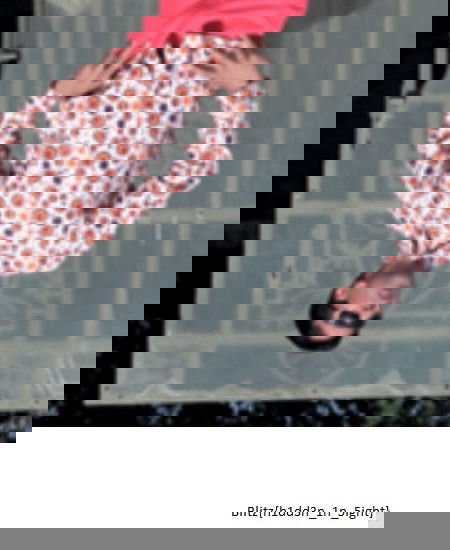

# Eyes Never Lie

There wasn’t much to this challenge i tried stegseek and exiftools and remembers another chall where a jpg size was reduced and we had to change the size back to its original one

We can use Imhex to change the size of the image

After changing the image size we can see fragments of the flag

so from this image you can make out

Blitz{h1dd3n_1n_5ight}
