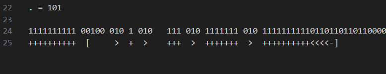

## Brainrot Snake

Quite interesting challenge. First step was git exploration. Kept it limited to changed by D0S4. The badapple.b file seemed irrelevant since it was already present in original repo.

### Part 1
In the first commit from D0S4, there was addition of some brainfuck code. So I just put it in an online interpreter, and got `Blitz{Brain`. 


Now these 2 mysterious strings remained -
000000000000000000000000000000110010000010000000000010000000000000000000000010000000000000000000000000000000011011011011001111010010010000000000000000000000000000000000000100010000000000000000000000000000000000100011011000000000000000000000000000000000000000000000000000000000000000000000000000100100100100

and 

111111111100100010101011101011111110101111111111011011011011000001101001001001000000000000000000101001111111111110010100111111111111111111110010101111111001010001010000000000001010010000000001010010111111111111111111111111111111001010


### Part 2
after some looking around, i found that no matter the text, `++++++++++[>+>+++>+++++++>++++++++++<<<<-]>>>` remained constant and a starting part.
It had 10 + in beginning and the string we found had 30 0s. This confirmed that 3 bits, which can map to 8 things, are mapped to 8 chars of brainfuck language. We already knew + was 000 expaning this, we split the binary bits to chunks of three, and mathched them with known prefix. So we got the mapping for 6/8 chars(+-[]><). Next I analyzed for every text, brainfuck code ended with `.`. So we got mapping for 7/8, and deduced for the final character. We complete mapping, it became 

```++++++++++[>+>+++>+++++++>++++++++++<<<<-]>>>++++++++++++.>+++++++++++.<<+++++++++++++++++++++++++....```

 which when executed gave `Ro7777`


 ### Part 3
 Now it was evident that part 3 string would also map out to some brainfuck code, but it was much shorter, and didn't match the prefix in same fashion. This hinted at huffman encoding. Same process, trying to map out the known prefix to brainfuck char. Assuming valid huffman helps out, as we there is 01 is something, we can be sure that 010 or 011 are invalid codes.

 

 Now, all that was left was to keep matching it with prefix and suffix, while making sure mapping remains consistent. 

 The final mapping turned out to be =>
 ```
 + = 1
[ = 00100
> = 010
< = 011
- = 000
] = 0011
. = 001010
```

giving us the final string `_P0774N}`.